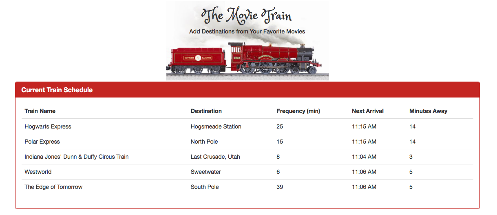
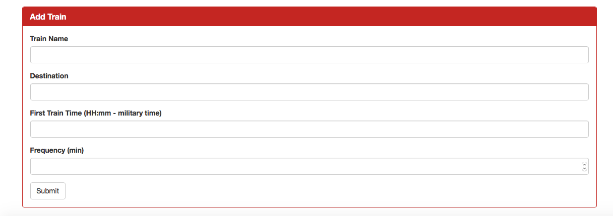

# Train-Scheduler

# Train-Scheduler App

## Overview

A Firebase backed train schedule application that utilizes HTML, CSS and jQuery to render the schedule and admin panel on the web page.

## Experience the App

* View the app: [GitHub Pages Link](https://nicolelcarvalho.github.io/Train-Scheduler/)

## Illustration

## Tech Used
- Firebase
- HTML
- CSS
- Moment.js
- JavaScript / jQuery

## Built With

* Sublime Text - Text Editor

